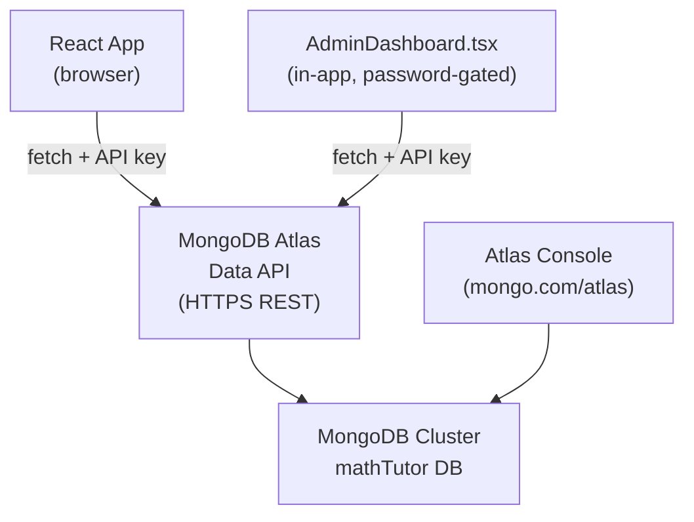
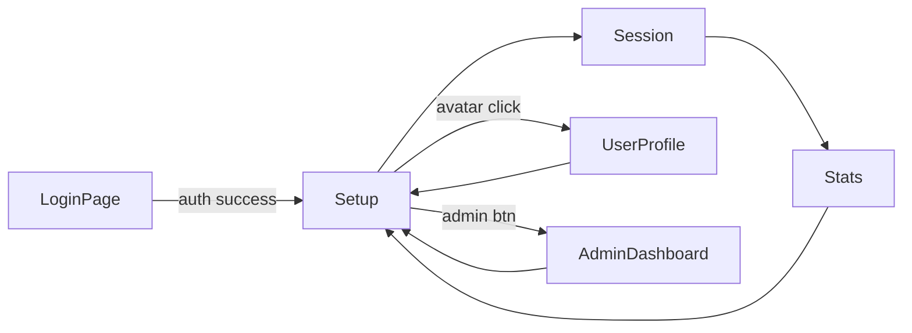

# MongoDB Atlas User Management Plan

## How the browser talks to MongoDB (no backend needed)

MongoDB Atlas provides a **Data API** — a set of HTTPS REST endpoints that accept JSON. The React app calls these endpoints directly using `fetch`. An API key (stored in `.env`) authenticates every request.




## What you need to do in MongoDB Atlas (one-time setup)

1. Create a free account at [cloud.mongodb.com](https://cloud.mongodb.com)
2. Create a free **M0** cluster
3. Go to **App Services** > Create a new App
4. Go to **HTTPS Endpoints** > Enable **Data API**
5. Copy the **App ID** and **Base URL**
6. Create an **API Key** under Authentication > API Keys
7. Fill in `.env` (template will be provided)

The database and collections are created automatically on first write.

## MongoDB Data Structure

```
Database: mathTutor
Collections:
  users      — profile + hashed credentials
  progress   — per-user learning progress + session history
```

- `users` document:

```json
{
  "_id": "<ObjectId>",
  "userId": "u_abc123",
  "username": "avigail",
  "displayName": "אביגיל",
  "avatarEmoji": "🦁",
  "createdAt": "2026-03-16T...",
  "passwordHash": "sha256hex...",
  "salt": "randomhex..."
}
```

- `progress` document:

```json
{
  "_id": "<ObjectId>",
  "userId": "u_abc123",
  "totalQuestionsAnswered": 42,
  "correctAnswers": 35,
  "incorrectAnswers": 7,
  "categoriesProgress": { ... },
  "streak": 3,
  "lastSessionDate": "...",
  "sessionHistory": [ ... ]
}
```

## New Files to Create

### Services

- `src/services/MongoDBService.ts` - thin wrapper around Atlas Data API (`findOne`, `find`, `insertOne`, `updateOne`, `deleteOne`)
- `src/services/AuthService.ts` - register/login using MongoDB; passwords hashed with Web Crypto (SHA-256 + salt); session in `localStorage`
- `src/services/UserService.ts` - read/update/delete user profile and progress from MongoDB

### Context

- `src/context/AuthContext.tsx` - global auth state (`currentUser`, `login`, `logout`, `register`)

### Components

- `src/components/LoginPage.tsx` - full-screen login/register with Dragon mascot, tab switch, avatar picker, Hebrew validation
- `src/components/UserAvatar.tsx` - header badge with dropdown (profile / logout)
- `src/components/UserProfilePage.tsx` - edit display name + avatar, delete account
- `src/components/DeleteAccountModal.tsx` - confirm delete with dragon "sad" reaction
- `src/components/UserProgressDashboard.tsx` - per-user stats (replaces `StatisticsCard`)
- `src/components/AdminDashboard.tsx` - password-gated admin panel showing all users, progress stats, delete user

## Modified Files

### `[src/types/index.ts](russian-math-tutor/src/types/index.ts)`

Add:

```ts
export interface UserProfile { userId, username, displayName, avatarEmoji, createdAt }
export interface UserCredentials { username, passwordHash, salt }
export interface AuthState { isLoggedIn, currentUser }
```

### `[src/App.tsx](russian-math-tutor/src/App.tsx)`

- `AppState` gains `'login' | 'profile' | 'admin'`
- Header shows `<UserAvatar>` when logged in + admin button
- `<LoginPage>` renders when `appState === 'login'`

### `[src/index.tsx](russian-math-tutor/src/index.tsx)`

- Wrap `<App>` with `<AuthProvider>`

### `[src/services/ProgressService.ts](russian-math-tutor/src/services/ProgressService.ts)`

- Add `switchUser(userId)` to load user-scoped progress from MongoDB
- `saveProgress()` writes to MongoDB in addition to localStorage (offline fallback)

## Admin Dashboard Features

- Protected by `REACT_APP_ADMIN_PASSWORD` env variable
- Reads all documents from `users` and `progress` collections via Data API
- Displays: user list table (name, username, avatar, join date, total sessions, accuracy)
- Per-user detail view: session history, category breakdown
- Delete user (removes from both collections)
- Export all data as JSON

## App State Flow




## Environment Variables (`.env`)

```
REACT_APP_MONGODB_DATA_API_URL=https://data.mongodb-api.com/app/YOUR_APP_ID/endpoint/data/v1
REACT_APP_MONGODB_API_KEY=YOUR_API_KEY
REACT_APP_MONGODB_DATABASE=mathTutor
REACT_APP_ADMIN_PASSWORD=choose_a_secure_password
```

## New Dependency (1 package)

- No new packages needed — all MongoDB Data API calls use the native browser `fetch`

## Implementation Order

1. Create `.env.template` with MongoDB variables
2. Create `MongoDBService.ts`
3. Add user types to `types/index.ts`
4. Create `AuthService.ts`
5. Create `UserService.ts`
6. Create `AuthContext.tsx`
7. Update `ProgressService.ts` (user-scoped + MongoDB sync)
8. Build `LoginPage.tsx`
9. Build `UserAvatar.tsx`, `UserProfilePage.tsx`, `DeleteAccountModal.tsx`
10. Build `UserProgressDashboard.tsx`
11. Build `AdminDashboard.tsx`
12. Wire `App.tsx` and `index.tsx`

