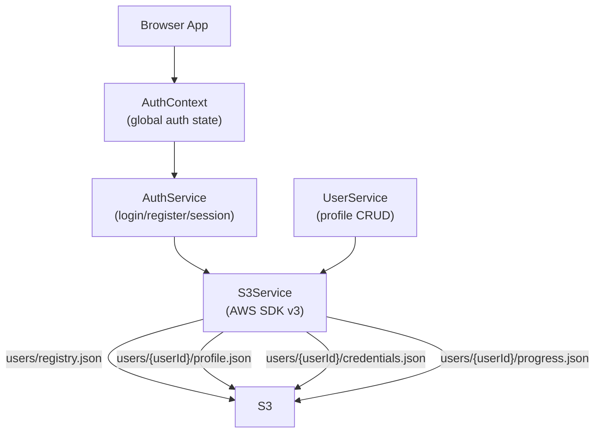
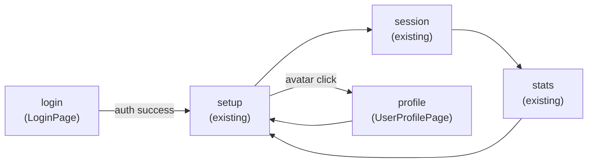

# User Management System - AWS S3 Integration Plan

## Security Notice

Since there is no backend, AWS credentials will live in a `.env` file and be bundled into the browser app. You must create a **restricted IAM user** with write-only/read-own-prefix S3 permissions to minimize exposure.

## Architecture Overview




## S3 Bucket Structure

```
math-tutor-users/
└── users/
    ├── registry.json             ← username → userId map (for login lookup)
    └── {userId}/
        ├── profile.json          ← displayName, username, avatar emoji, createdAt
        ├── credentials.json      ← passwordHash (SHA-256 + salt), salt
        ├── progress.json         ← StudentProgress (mirrors current ProgressService data)
        └── statistics.json       ← per-session stats, category breakdowns
```

## New Files to Create

### Context

- `src/context/AuthContext.tsx` - global auth state: `currentUser`, `login()`, `logout()`, `register()`

### Services

- `src/services/S3Service.ts` - AWS SDK v3 wrapper: `getObject`, `putObject`, `deleteObject`
- `src/services/AuthService.ts` - hash password (Web Crypto API, no extra packages), compare hash, read/write credentials to S3, session via `localStorage`
- `src/services/UserService.ts` - read/update/delete user profile and progress from S3

### Components

- `src/components/LoginPage.tsx` - full-screen sign in / sign up with tab switch, Framer Motion, Dragon mascot
- `src/components/UserProfilePage.tsx` - view/edit profile (display name, avatar emoji picker), delete account
- `src/components/UserAvatar.tsx` - small user badge shown in the app header
- `src/components/UserProgressDashboard.tsx` - rich per-user stats dashboard (replaces current `StatisticsCard` with user-specific data)
- `src/components/DeleteAccountModal.tsx` - confirmation modal with dragon reaction

## Modified Files

### `[src/types/index.ts](russian-math-tutor/src/types/index.ts)`

Add new interfaces:

```ts
export interface UserProfile {
  userId: string;
  username: string;
  displayName: string;
  avatarEmoji: string;
  createdAt: string;
}
export interface UserCredentials {
  username: string;
  passwordHash: string;
  salt: string;
}
export interface AuthState {
  isLoggedIn: boolean;
  currentUser: UserProfile | null;
}
```

### `[src/App.tsx](russian-math-tutor/src/App.tsx)`

- Wrap app in `<AuthProvider>` (from `AuthContext`)
- Add `appState = 'login'` as initial state (show login before setup)
- Show `<UserAvatar>` in the header when logged in
- Add `appState = 'profile'` to render `<UserProfilePage>`

### `[src/services/ProgressService.ts](russian-math-tutor/src/services/ProgressService.ts)`

- After every `recordAnswer` / `completeSession`, sync progress to S3 via `UserService.saveProgress(userId, progress)`

### `[src/index.tsx](russian-math-tutor/src/index.tsx)`

- Wrap `<App>` with `<AuthProvider>`

## New Dependencies (1 package)

- `@aws-sdk/client-s3` — AWS SDK v3 S3 client (tree-shakeable, browser-compatible)

## Environment Variables (`.env`)

```
REACT_APP_AWS_REGION=us-east-1
REACT_APP_AWS_ACCESS_KEY_ID=...
REACT_APP_AWS_SECRET_ACCESS_KEY=...
REACT_APP_S3_BUCKET_NAME=math-tutor-users
```

## UI Design Approach

**Login Page:**

- Full-screen gradient (matching existing kids theme)
- Centered glassmorphism card
- Toggle tabs: "כניסה" (Sign In) / "הרשמה" (Sign Up)
- Dragon mascot on side with speech bubble guidance
- Animated field validation in Hebrew
- Framer Motion entrance/exit animations

**Header (when logged in):**

- Small avatar emoji + display name badge (top-left)
- Clicking opens dropdown: "פרופיל" / "התנתק"

**Profile Page:**

- Display name editable inline
- Emoji avatar picker (grid of fun emojis)
- Account info: joined date, total sessions played
- Red "מחיקת חשבון" button at bottom
- Dragon reacts to delete with "sad" mood

**User Progress Dashboard:**

- Replaces static `StatisticsCard` with personalized, per-user data fetched from S3
- Highlights: accuracy %, total questions, strongest/weakest category
- Recent 5 sessions list with color-coded scores
- All centered, no hover animations (consistent with existing fix)

## App State Flow




## Implementation Order

1. Install `@aws-sdk/client-s3`, create `.env` template
2. Add new types to `types/index.ts`
3. Create `S3Service.ts`
4. Create `AuthService.ts` (password hashing + S3 read/write)
5. Create `UserService.ts` (profile CRUD)
6. Create `AuthContext.tsx`
7. Build `LoginPage.tsx` with modern UI
8. Build `UserAvatar.tsx` + `UserProfilePage.tsx` + `DeleteAccountModal.tsx`
9. Build `UserProgressDashboard.tsx`
10. Wire everything into `App.tsx` and `index.tsx`
11. Update `ProgressService.ts` to sync to S3

