# Architecture Diagram — Adaptive Logic Layer (Full)

הדבק את הקוד הבא בכתובת: https://mermaid.live

```mermaid
flowchart TD
    %% ── STYLE ──────────────────────────────────────────────
    classDef decision  fill:#1a1a1a,stroke:#fff,color:#fff,shape:diamond
    classDef process   fill:#1e3a5f,stroke:#4a9eff,color:#fff
    classDef adaptive  fill:#1a3a1a,stroke:#4aff4a,color:#fff
    classDef output    fill:#3a1a1a,stroke:#ff4a4a,color:#fff
    classDef storage   fill:#2a1a3a,stroke:#9a4aff,color:#fff
    classDef milestone fill:#3a2a00,stroke:#ffaa00,color:#fff

    %% ── SESSION LOOP ────────────────────────────────────────
    START([▶ ילד לוחץ התחל]):::milestone
    START --> LOAD_WEAK

    LOAD_WEAK["💾 טען weakQuestionIds\nמ-ProgressService"]:::storage
    LOAD_WEAK --> HAS_WEAK

    HAS_WEAK{weakQuestionIds\n.length > 0?}:::decision

    %% ── YES: ADAPTIVE PATH ─────────────────────────────────
    HAS_WEAK -->|כן| ADAPTIVE_SESSION
    ADAPTIVE_SESSION["🔁 createAdaptiveSession()\n─────────────────────\nreview_q = min(weak.length, ⌊n × 0.6⌋)\nfresh_q  = n − review_q"]:::adaptive

    ADAPTIVE_SESSION --> FILTER_DIFF
    FILTER_DIFF["🔍 סנן לפי category + difficulty\n(התאמה להגדרות המשתמש)"]:::process
    FILTER_DIFF --> SHUFFLE_MIX

    SHUFFLE_MIX["🔀 ערבב: review + fresh\n(סדר אקראי — לא ברור מה חזרה)"]:::process
    SHUFFLE_MIX --> MARK_REVIEW

    MARK_REVIEW["🏷️ סמן שאלות חזרה:\nisReview = true"]:::process
    MARK_REVIEW --> SESSION_READY

    %% ── NO: REGULAR PATH ───────────────────────────────────
    HAS_WEAK -->|לא| REGULAR_SESSION
    REGULAR_SESSION["✨ createSession()\n─────────────────────\n100% שאלות חדשות אקראיות"]:::process
    REGULAR_SESSION --> SESSION_READY

    %% ── SESSION EXECUTION LOOP ─────────────────────────────
    SESSION_READY(["📋 Session מוכן\nn שאלות בתור"]):::milestone
    SESSION_READY --> NEXT_Q

    NEXT_Q["📢 TTS: קרא שאלה בקול\n(he-IL SpeechSynthesis)"]:::process

    NEXT_Q --> IS_REVIEW_Q
    IS_REVIEW_Q{isReview\n= true?}:::decision
    IS_REVIEW_Q -->|כן| DRAGON_REVIEW["🐉 דרקון: 'בואו נחזור\nעל שאלה שהייתה קשה!'"]:::adaptive
    IS_REVIEW_Q -->|לא| DRAGON_NEW["🐉 דרקון: 'שאלה חדשה!'"]:::process
    DRAGON_REVIEW --> LISTEN
    DRAGON_NEW --> LISTEN

    LISTEN["🎤 האזן לתשובה\n(STT Web Speech API)"]:::process
    LISTEN --> TRANSCRIPT_OK

    TRANSCRIPT_OK{transcript\nתקין?}:::decision
    TRANSCRIPT_OK -->|לא / null| REPEAT_BTN

    REPEAT_BTN{"לחץ 🔊\n'חזור על השאלה'?"}:::decision
    REPEAT_BTN -->|כן| NEXT_Q
    REPEAT_BTN -->|לא / timeout| NULL_COUNT

    NULL_COUNT{"כשלונות\nרצופים ≥ 3?"}:::decision
    NULL_COUNT -->|לא| LISTEN
    NULL_COUNT -->|כן| SKIP_Q["⏭️ דלג לשאלה\n+ הוסף ל-weakList"]:::output
    SKIP_Q --> SESSION_COMPLETE_CHECK

    TRANSCRIPT_OK -->|כן| PARSE_NUM
    PARSE_NUM["📝 parseNumber()\nמילים עבריות → מספר"]:::process
    PARSE_NUM --> EVAL

    EVAL{תשובה\n= correctAnswer?}:::decision

    %% ── CORRECT ────────────────────────────────────────────
    EVAL -->|✅ נכון| WAS_REVIEW
    WAS_REVIEW{isReview\n= true?}:::decision
    WAS_REVIEW -->|כן| PRAISE_REVIEW["🌟 דרקון: 'מעולה!\nהשתפרת בשאלה הזו!'"]:::adaptive
    WAS_REVIEW -->|לא| PRAISE_REGULAR["⭐ דרקון: 'כל הכבוד!\nתשובה נכונה!'"]:::process
    PRAISE_REVIEW --> RECORD_CORRECT
    PRAISE_REGULAR --> RECORD_CORRECT

    RECORD_CORRECT["💾 recordAnswer(correct)\nProgressService"]:::storage
    RECORD_CORRECT --> SESSION_COMPLETE_CHECK

    %% ── WRONG ──────────────────────────────────────────────
    EVAL -->|❌ שגוי| ENCOURAGE
    ENCOURAGE["💙 דרקון: 'לא נורא!\nפעם הבאה תצליח!'"]:::output
    ENCOURAGE --> RECORD_WRONG
    RECORD_WRONG["💾 recordAnswer(wrong)\nProgressService"]:::storage
    RECORD_WRONG --> SESSION_COMPLETE_CHECK

    %% ── SESSION COMPLETE CHECK ──────────────────────────────
    SESSION_COMPLETE_CHECK{עוד שאלות\nבתור?}:::decision
    SESSION_COMPLETE_CHECK -->|כן| NEXT_Q
    SESSION_COMPLETE_CHECK -->|לא| SESSION_END

    %% ── SESSION END ─────────────────────────────────────────
    SESSION_END(["🏁 סשן הסתיים"]):::milestone
    SESSION_END --> UPDATE_WEAK

    UPDATE_WEAK["🔄 עדכן weakQuestionIds\n─────────────────────\n+ הוסף: שאלות שנענו שגוי\n− הסר: review שנענו נכון"]:::adaptive

    UPDATE_WEAK --> SAVE_PROGRESS

    SAVE_PROGRESS["💾 saveProgress()\n─────────────────────\nlocalStorage (מיידי)\nMongoDB Atlas (async)"]:::storage

    SAVE_PROGRESS --> SHOW_RESULTS

    SHOW_RESULTS["📊 הצג סיכום סשן\naccuracy / streak / weak count"]:::process
    SHOW_RESULTS --> NEXT_SESSION_HINT

    NEXT_SESSION_HINT{weakList\n> 0?}:::decision
    NEXT_SESSION_HINT -->|כן| HINT_ADAPTIVE["💡 'הסשן הבא יכלול\nחזרה על X שאלות'"]:::adaptive
    NEXT_SESSION_HINT -->|לא| HINT_FRESH["🌟 'מצוין! הסשן הבא\nיהיה עם שאלות חדשות!'"]:::process
    HINT_ADAPTIVE --> END
    HINT_FRESH --> END

    END([⏹ חזור למסך הבית]):::milestone
```

---

## מקרא צבעים

| צבע | משמעות |
|-----|--------|
| 🔵 כחול כהה | עיבוד רגיל (Process) |
| 🟢 ירוק כהה | לוגיקה אדפטיבית (Adaptive) |
| 🔴 אדום כהה | תגובה לשגיאה (Error/Wrong) |
| 🟣 סגול | אחסון נתונים (Storage) |
| 🟡 זהב | נקודות ציון (Milestone) |
| ⬛ שחור | נקודת החלטה (Decision) |
