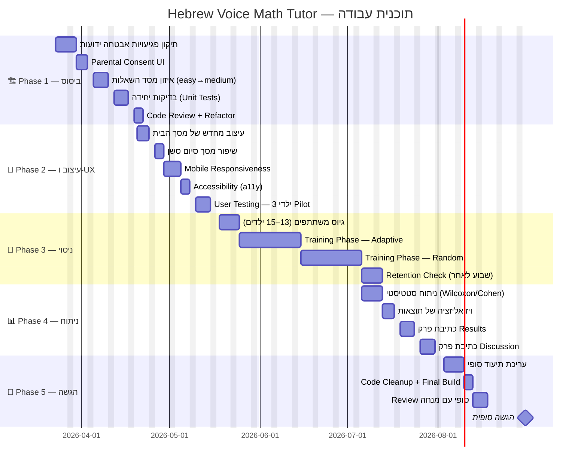

# Roadmap לפרויקט — Hebrew Voice Math Tutor
## תוכנית עבודה: מרץ 2026 → אוגוסט 2026

---

## תרשים Gantt



---

## פירוט שלבים

### 🏗️ Phase 1 — ביסוס טכני
**23 מרץ → 17 אפריל (4 שבועות)**

| שבוע | משימה | תוצרים | עדיפות |
|------|-------|---------|--------|
| 23–27 מרץ | תיקון אבטחה: ENV validation, error messages | `SECURITY.md`, תיקוני קוד | 🔴 קריטי |
| 30 מרץ–2 אפריל | Parental Consent — מסך טרום-הרשמה | `ConsentPage.tsx` | 🔴 קריטי |
| 6–9 אפריל | איזון שאלות: הוספת 25 שאלות medium/hard | `questions.json` v1.1.0 | 🟡 גבוה |
| 13–17 אפריל | Unit Tests לכל service + Code Review | `*.test.ts`, CI pass | 🟡 גבוה |

**הגדרת Done:** הקוד עובר `npm test` ללא שגיאות, Parental Consent מוצג לפני הרשמה.

---

### 🎨 Phase 2 — עיצוב ו-UX משופר
**20 אפריל → 15 מאי (4 שבועות)**

| שבוע | משימה | תוצרים | עדיפות |
|------|-------|---------|--------|
| 20–23 אפריל | עיצוב מחדש Home — Hero + Progress Summary | עיצוב Figma/CSS | 🟡 גבוה |
| 27–30 אפריל | מסך סיום סשן — ויזואליזציה תוצאות + שיתוף | `SessionSummary.tsx` | 🟡 גבוה |
| 4–7 מאי | Mobile First — תמיכה ב-tablets ו-phones | CSS media queries | 🟠 בינוני |
| 11–15 מאי | Accessibility: ARIA, keyboard navigation | audit report | 🟠 בינוני |

**Pilot Test (18 מאי):** 3 ילדים → תיעוד שגיאות UX.

---

### 🔬 Phase 3 — ביצוע הניסוי
**18 מאי → 1 יולי (6.5 שבועות)**

```
שבוע 1    │ גיוס 13–15 משתתפים + Consent הורים
שבועות 2–4 │ Training Phase — תנאי Adaptive (5 סשנים × ילד)
שבועות 5–7 │ Training Phase — תנאי Random   (5 סשנים × ילד)
          │ *** Washout: 48h בין תנאים ***
שבוע 8    │ Retention Check — מדידה שבוע לאחר סיום
```

| שלב | תאריכים | מה מתועד |
|-----|---------|---------|
| Pilot (3 ילדים) | 18–22 מאי | בעיות UI, בעיות זיהוי קול |
| Adaptive Group | 25 מאי–12 יוני | `accuracy_weak`, `session_duration` |
| Random Group | 15 יוני–1 יולי | `accuracy_overall`, `repeat_rate` |
| Retention | 6–8 יולי | `retention_score` |

**כלי איסוף נתונים:**
- AdminDashboard → Export JSON לכל ילד
- גיליון Google Sheets מקביל (גיבוי)

---

### 📊 Phase 4 — ניתוח וכתיבה
**6 יולי → 31 יולי (4 שבועות)**

| שבוע | משימה | כלים |
|------|-------|------|
| 6–9 יולי | ניתוח Wilcoxon Signed-Rank, Cohen's d | Python (scipy) / R |
| 13–16 יולי | גרפים: boxplot, bar chart accuracy | matplotlib / ggplot2 |
| 20–23 יולי | כתיבת פרק Results | Word / LaTeX |
| 27–30 יולי | כתיבת פרק Discussion + Limitations | Word / LaTeX |

**תוצר:** טבלה סטטיסטית מוכנה להגשה:

```
Condition    | Mean Accuracy | SD    | W     | p-value | d
-------------|---------------|-------|-------|---------|---
Adaptive     | ?             | ?     | ?     | ?       | ?
Random       | ?             | ?     | —     | —       | —
```

---

### 📝 Phase 5 — פינישינג ×הגשה
**3 אוגוסט → 31 אוגוסט (4 שבועות)**

| שבוע | משימה | תוצרים |
|------|-------|--------|
| 3–6 אוגוסט | עדכון README, EXPERIMENT, ETHICS | docs מעודכנים |
| 10–13 אוגוסט | `npm run build` + בדיקת production build | `/build` מוכן |
| 17–20 אוגוסט | Review סופי עם מנחה + תיקונים | פידבק מתוקן |
| 24–28 אוגוסט | הכנת מצגת + תיעוד אחרון | PPT/PDF |
| **31 אוגוסט** | **⭐ הגשה סופית** | **zip / GitHub link** |

---

## סיכום לפי חודש

| חודש | Phase | פוקוס מרכזי | אבן דרך |
|------|-------|------------|---------|
| **מרץ** (שבוע אחד) | Phase 1 | אבטחה + Consent | קוד בטוח |
| **אפריל** | Phase 1–2 | ביסוס + עיצוב | Tests עוברות |
| **מאי** | Phase 2–3 | עיצוב + Pilot | UI מלוטש + Pilot done |
| **יוני** | Phase 3 | ניסוי ראשי | נתונים מ-13+ ילדים |
| **יולי** | Phase 3–4 | ניתוח + כתיבה | תוצאות סטטיסטיות |
| **אוגוסט** | Phase 5 | פינישינג + הגשה | ⭐ הגשה 31/8 |

---

## ניהול סיכונים

| סיכון | סבירות | השפעה | מיתון |
|-------|--------|-------|-------|
| קושי גיוס ילדים (פחות מ-13) | בינונית | גבוהה | גייס 20, צפה נשירה 30% |
| ילד עוזב באמצע הניסוי | בינונית | בינונית | תעד חלקי, exclude מניתוח |
| בעיית זיהוי קול (Chrome update) | נמוכה | גבוהה | בדוק Chrome 124 מוקדם |
| עיכוב בכתיבה | גבוהה | בינונית | שמור buffer שבועיים באוגוסט |
| MongoDB Atlas downtime | נמוכה | נמוכה | localStorage fallback פעיל |

---

## KPIs להגשה

- [ ] `npm test` — 100% pass
- [ ] לפחות 13 משתתפים בניסוי
- [ ] p-value < 0.05 **או** דיון מנומק מדוע לא
- [ ] README + EXPERIMENT + ETHICS מלאים
- [ ] Production build עובד ללא שגיאות
- [ ] Demo video (3–5 דקות)
